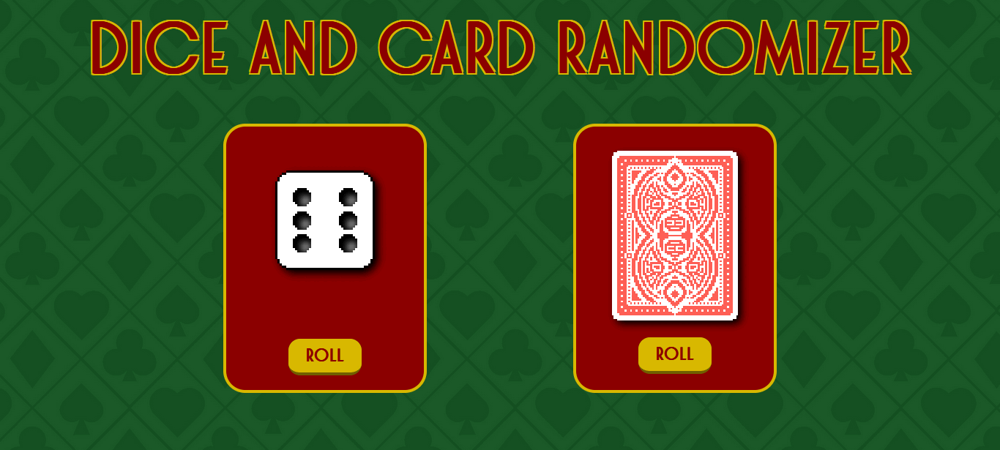

# Dice and Card Randomizer

## Description

This is a web application that allows users to roll virtual dice and draw random playing cards. Developed with HTML, CSS, and JavaScript, the project provides a fun way to simulate dice rolls and card draws with simple animations.

## Features

- Roll a virtual dice with realistic dot placements.
- Draw a random playing card from a deck.
- Smooth rolling animations for both dice and cards.
- Simple and intuitive user interface.

## Technologies Used

- HTML5
- CSS3
- JavaScript (ES6)

## Installation and Usage

1. Clone this repository or download the files manually.
2. Open the `index.html` file in your preferred browser.
3. Click the "Roll" button to roll the dice.
4. Click the "Roll" button under the cards section to draw a random card.

## Project Structure

```
dice-card-randomizer/
│-- index.html
│-- main.css
│-- main.js
│-- media/
│   ├── front.png
│   ├── back.png
│   ├── cards.png
```

## Screenshot



## License

This project is licensed under the MIT License.


